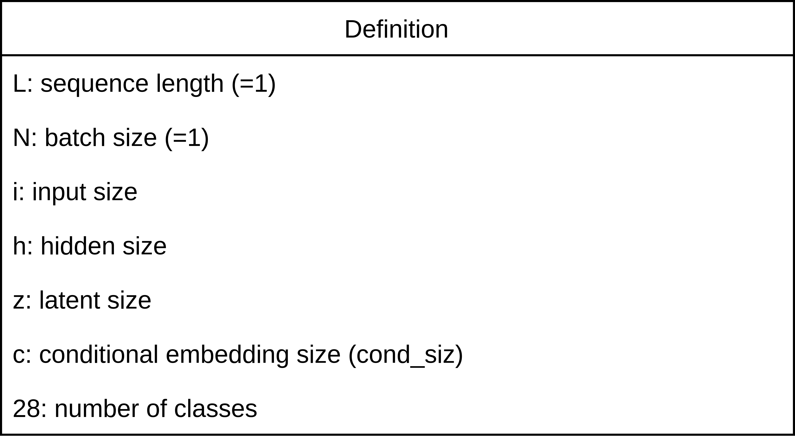
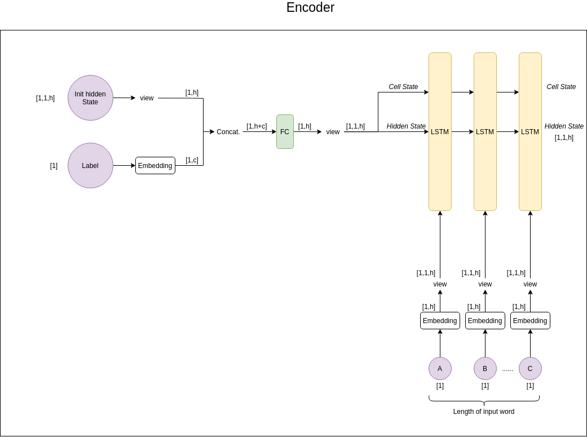
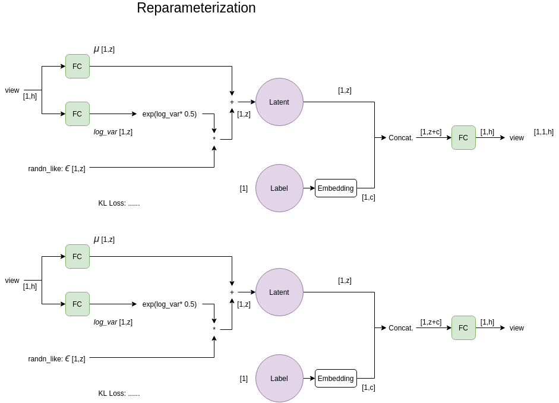
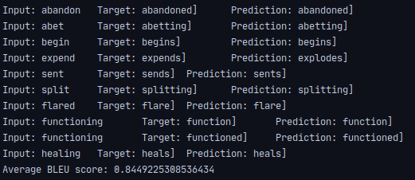
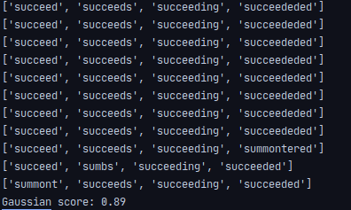
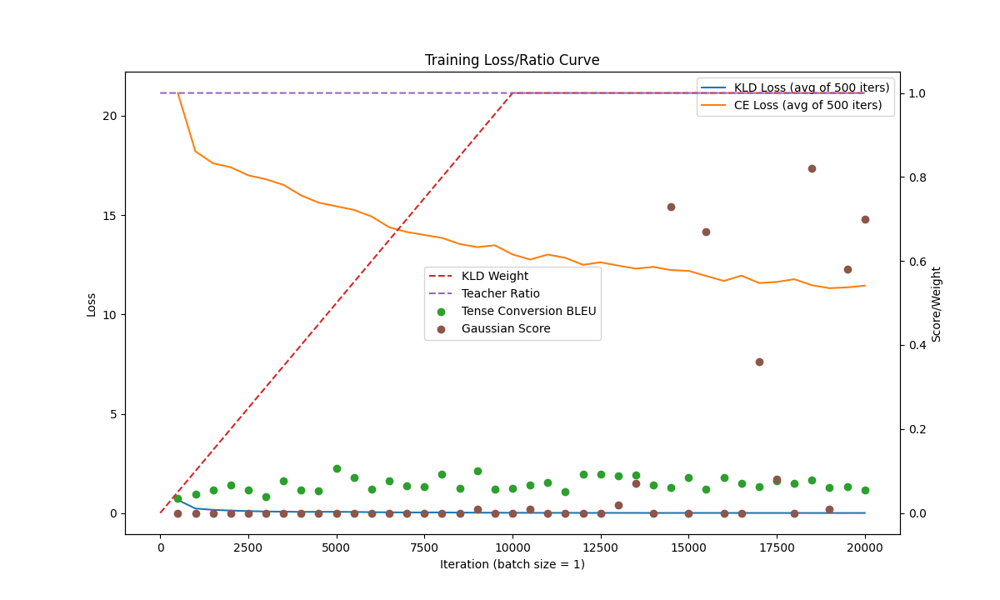
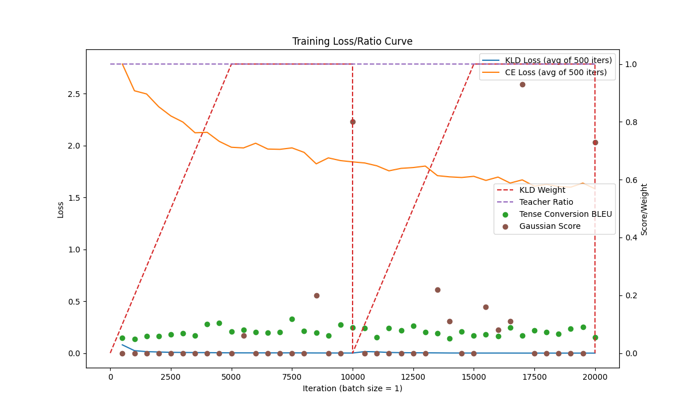
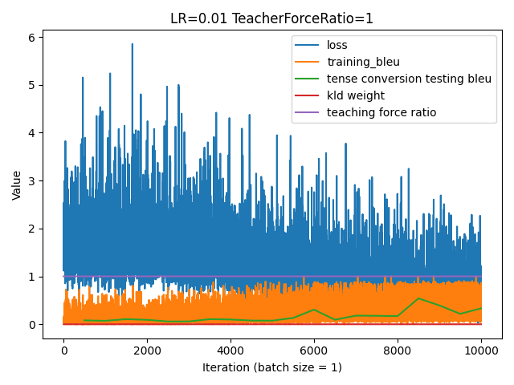
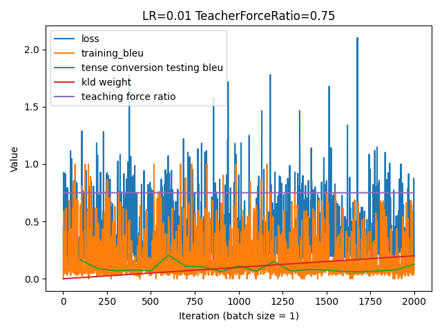

# Seq2Seq + CVAE (English Tense Conversion)

## Introduction

「Conditional Sequence-to-Sequence VAE」從字面上的意思能得知做的是把 Conditional VAE 和 Sequence-to-Sequence 結合起來。  
模型主要由 encoder 和 decoder 結合，encoder 和 decoder 使用了 RNN (這裡採用 LSTM)，encoder 將輸入轉化成 latent code，decoder 再對 latent code 進行運算。Seq2Seq 特別的地方是能做到「不同長度」的序列轉換。  
Conditional VAE 是一種 autoencoder 的變化，和一般 VAE 差異是多了「conditional」的功能。本實驗的主要任務是將這樣的模型應用在英文時態轉換和英文時態產生上。藉由調整各個參數與觀察實驗的現象，更加深入地了解這個架構。

本實驗目標：
1. English tense conversion
2. Producing different words with 4 tenses (藉由 VAE 特性)

Dataset:  
Go here to download: train.txt & test.txt & read its README.md
[https://github.com/110805/Tense_Conversion](https://github.com/110805/Tense_Conversion)

## Implementation Details

整體架構

P.S. 紫色是 input 的意思。中括號是 tensor 大小。（都假設 batch size 是 1）

模型分成了 encoder 和 decoder 兩塊。每個文字輸入和 label 都會先經過 embedding layer。

### Variable Definition

### Encoder

細節都在圖上了～包括 tensor shape 等等

### Reparameterization & Decoder

我把 reparameterization trick 和 decoder 做在同一個架構裡。

Reparameterization trick 的輸入是剛剛 encoder 的 hidden state 和 cell state 的輸出。分別經過 fully connected layer 後變成 $\mu$ 和 $\log Var$。Gaussian noise 使用 `torch.randn_like(mu)` 產生。

後來有嘗試做成 batch size 可以 > 1 的構造，同一個 batch 若單字的長度不一，採用`PAD_TOKEN`填滿，PAD 的部分不算 loss，太長的部分也不算 loss，只算到 target size 的長度。

## Results & Discussion

#### 最佳 Tense Conversion BLEU Score

由於發現 Gaussian noise 每次取樣不同會使得結果不一樣，所以我做了 100 次取平均。直接取 noise 為零也是一種方式。

- Average tense conversion BLEU: **0.84**

其中一次的輸入。（右括號是 EOS，可以不要管它）

#### 最佳 Tense Generation Gaussian Score

當下有點嚇到，0.89 有點太高的感覺...。把 output 印出來看，他分數這麼高是因為大多猜一樣的字。而這樣的狀況，剛好也符合 Gaussion_score 函式算分數的方式，所以就得到很高分。推測程式可能有誤或沒讓模型練到常態分佈，導致沒有多樣性，得到不理想的結果。

#### KL-Annealing

Monotonic

Cyclical

#### Teacher Force Ratio

發現 teacher force ratio < 1 的話，結果較不穩定。所以初期應該要先設大一點，穩定後再嘗試調小數值。

## P.S.

- tcab = tense conversion average BLEU score 